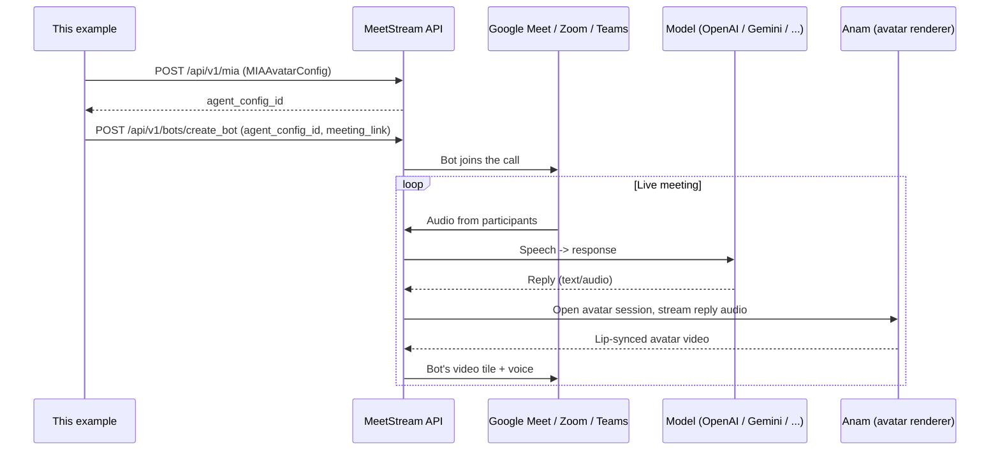

# MIA Avatar Agent

Give your MIA agent a photorealistic, animated face that lip-syncs to its voice in real time on the bot's video tile — right inside a live Google Meet, Zoom, or Microsoft Teams call.

MeetStream uses [Anam](https://anam.ai) as the avatar provider. Avatars work in both **realtime** and **pipeline** MIA modes, across all three supported meeting platforms.

This example is the runnable version of `MIAAvatarConfig`: it fetches a valid `avatar_id`, creates an avatar-enabled MIA agent, and deploys it into a real meeting.

> **Nothing here is shared or preconfigured.** Every person running this example brings their own MeetStream API key, their own Anam avatar, and gets their own freshly created MIA agent (`agent_config_id`) tied to their own MeetStream account. There is no default agent or avatar baked into this repo — see [Setup](#setup) below to create yours.

## Prerequisites

- [Node.js](https://nodejs.org/) 18 or newer (tested on Node 22)
- A MeetStream API key
- An [Anam](https://anam.ai) account with an API key
- Your Anam API key saved in the MeetStream dashboard under **Integrations → Avatar → Anam**

## How it works

This example only ever talks to MeetStream's API — it never talks to Anam directly to render anything (the one exception is `list-avatars`, a convenience lookup). MeetStream orchestrates the model, the meeting platform, and Anam on your behalf:



Concretely: `npm run create-agent` builds a `MIAAvatarConfig` (model + voice + `Avatar.avatar_id`) and registers it with MeetStream. `npm run deploy` then tells MeetStream to send a bot carrying that config into a specific meeting. From there, MeetStream's backend handles everything live — transcribing the room, running the model, and opening a session with Anam to render the avatar's face on the bot's video track. This repo's code never touches meeting audio/video streams directly.

## Setup

```bash
npm install
cp .env.example .env
```

On Windows `cmd.exe`, use `copy .env.example .env` instead (or `Copy-Item .env.example .env` in PowerShell).

Fill in `.env`:

| Variable | Description |
| --- | --- |
| `MEETSTREAM_API_KEY` | Your MeetStream API key |
| `ANAM_API_KEY` | Your Anam API key (also saved in MeetStream Integrations) |
| `ANAM_AVATAR_ID` | An Anam `avatar_id` — see [Finding your avatar_id](#finding-your-avatar_id) |
| `MEETING_LINK` | The Google Meet / Zoom / Teams link to join |
| `MIA_AGENT_CONFIG_ID` | Optional — set after `npm run create-agent`, or leave blank and `npm start` creates one for you |

### Configuring the agent

`npm run create-agent` doesn't have to build the one fixed agent shown above — the model, voice, prompt, and avatar details are all optional `.env` overrides (see the bottom of [`.env.example`](.env.example) for the full list, e.g. `MIA_MODEL_PROVIDER`, `MIA_MODEL_NAME`, `MIA_MODEL_VOICE`, `MIA_SYSTEM_PROMPT`, `MIA_FIRST_MESSAGE`, `ANAM_AVATAR_MODEL`, `ANAM_AVATAR_NAME`). Leave them blank to get the defaults matching MeetStream's own reference example, or set any of them to build a different agent — e.g. swap `MIA_MODEL_PROVIDER=google` / `MIA_MODEL_NAME=gemini-2.5-flash-native-audio-preview-12-2025` / `MIA_MODEL_VOICE=Puck` to use Gemini instead of OpenAI. For anything beyond that (transcriber, tools, VAD tuning, pipeline mode instead of realtime), edit the request body in [`src/createAvatarAgent.js`](src/createAvatarAgent.js) directly — it's a plain object matching [MeetStream's `create-agent-config` reference](https://docs.meetstream.ai/api-reference/api-endpoints/mia/create-agent-config).

### Finding your avatar_id

Anam accounts have both `persona_id`s and `avatar_id`s — both are UUIDs, but MeetStream needs the **avatar id** specifically. If you pass a persona id by mistake, MeetStream's error message tells you and shows how to fetch the correct one.

`GET /v1/avatars` (what `npm run list-avatars` calls) returns the full Anam avatar catalog available to your key — stock gallery avatars included, not just custom ones you've created. It's paginated (10 per page by default); this script only prints the first page, which is plenty to grab an id from:

```bash
npm run list-avatars
```

Copy an `id` from the output into `ANAM_AVATAR_ID`. If you'd rather browse faces before picking, use the [Anam Avatar Gallery](https://anam.ai/docs/personas/avatars/gallery) instead — same catalog, with previews, and no `.env` setup needed to look.

## Usage

Run the whole flow — create **your own** avatar agent (if you haven't already) and deploy it into `MEETING_LINK`:

```bash
npm start
```

Or run each step individually:

```bash
npm run create-agent   # creates a new MIA agent on YOUR MeetStream account, prints its agent_config_id
npm run deploy          # deploys MIA_AGENT_CONFIG_ID into MEETING_LINK
```

`npm run create-agent` creates a brand new agent every time it's run — save the printed `agent_config_id` into `MIA_AGENT_CONFIG_ID` in your `.env` so you reuse the same one instead of piling up new agents on your account.

When the bot joins, the avatar renders on the bot's participant tile and lip-syncs to every TTS response.

## MIAAvatarConfig reference

This is the exact `POST https://api.meetstream.ai/api/v1/mia` body [`createAvatarAgent.js`](src/createAvatarAgent.js) sends — it matches the ["Realtime - Avatar (Anam)"](https://docs.meetstream.ai/api-reference/api-endpoints/mia/create-agent-config) example in MeetStream's official API reference:

```json
{
  "agent_name": "MIA Avatar Agent",
  "mode": "realtime",
  "model": {
    "provider": "openai",
    "model": "gpt-realtime-mini",
    "system_prompt": "You are a helpful AI meeting assistant. Keep responses concise and natural. Listen actively and provide value to the conversation.",
    "first_message": "Hey there! I am your AI assistant, ready to help with your meeting.",
    "temperature": 0.8,
    "voice": "coral",
    "modalities": ["text", "audio"],
    "max_response_output_tokens": 200
  },
  "voice": null,
  "transcriber": null,
  "agent": {
    "tools": [],
    "preemptive_generation": false,
    "user_away_timeout": 15,
    "interruptions": { "min_duration_seconds": 0.5, "word_threshold": 0 },
    "false_interruption_timeout": 2,
    "vad_type": "server_vad",
    "enable_interruptions": true,
    "resume_false_interruption": true,
    "tools_enabled": false,
    "vad_threshold": 0.5,
    "vad_prefix_padding_ms": 0,
    "vad_silence_duration_ms": 200
  },
  "audio": {
    "sample_rate": 24000,
    "num_channels": 1
  },
  "wake_word": null,
  "Avatar": {
    "provider": "anam",
    "enabled": true,
    "avatar_id": "f0e7a8c4-1234-4abc-9def-0123456789ab"
  }
}
```

> **Note the casing:** MeetStream's official reference shows the avatar block as a top-level **`Avatar`** (capitalized) field, both in the request body and in every response payload — not `avatar`. We match that exactly. (In practice MeetStream's JSON parsing is case-insensitive on the way in, so lowercase `avatar` also works — but `Avatar` is what their docs and API responses actually use, so that's what this example sends.)

| Setting | Required | Description |
| --- | --- | --- |
| `Avatar.enabled` | No (default: `false`) | Whether the agent renders a video avatar |
| `Avatar.provider` | No (default: `anam`) | Avatar provider — currently `anam` only |
| `Avatar.avatar_id` | Yes (when enabled) | Anam `avatar_id` — see [Finding your avatar_id](#finding-your-avatar_id) |
| `Avatar.avatar_model` | No | Optional Anam `avatarModel` override |
| `Avatar.name` | No | Optional persona display name |

> "Required: No" above describes the general API — if you omit `Avatar.enabled` entirely in a raw request, it defaults to `false` (no avatar). This example is specifically about *having* an avatar, so [`createAvatarAgent.js`](src/createAvatarAgent.js) always sends `enabled: true` explicitly; it's never omitted here.

## Troubleshooting

**Bot joins the meeting fine, `video_required: true` is set, the agent config's `Avatar.enabled` is `true` with a valid `avatar_id` — but no avatar ever shows up, and there's no error at all:**

This is almost certainly a **stale or wrong Anam key saved in MeetStream Dashboard → Integrations → Avatar → Anam.** That dashboard key is what MeetStream's backend actually uses server-side to open the Anam avatar session during the live call — it's completely separate from `ANAM_API_KEY` in your local `.env` (which is only used by this repo's own `list-avatars` script).

Symptoms that point here specifically: `GET /api/v1/bots/{bot_id}` shows `InMeeting: true` and `Recording: true`, but `VideoProcessing` stays `false` forever with no timestamp and no message — across every model provider and avatar_id you try. If your Anam key works fine when called directly (`GET https://api.anam.ai/v1/avatars`, or creating a session token via `POST https://api.anam.ai/v1/auth/session-token`), but avatars still never render inside a MeetStream call, re-paste your current Anam key into the MeetStream dashboard integration and redeploy. That resolved it for us after a full afternoon of debugging every other variable (model provider, avatar_id, agent config) with no luck.

**Avatar doesn't appear, or the session fails to start (other causes):**

- **Wrong ID type** — MeetStream needs `avatar_id`, not `persona_id`. Grab one from the [Anam Avatar Gallery](https://anam.ai/docs/personas/avatars/gallery), or via `GET https://api.anam.ai/v1/avatars` (`npm run list-avatars`).
- **Anam API key rejected (401/403)** — the `ANAM_API_KEY` stored under MeetStream Integrations was rotated or is invalid. Update it in the dashboard.
- **Concurrent session limit** — Anam caps concurrent sessions per account and has no kill-session API. Orphaned sessions auto-expire at `maxSessionLengthSeconds` (~180s default). MeetStream's error message lists the open sessions and their expiry ETA.

## Dependencies

- **Node.js 18+** (tested on Node 22) — uses native `fetch`, no HTTP client dependency
- **[`dotenv`](https://www.npmjs.com/package/dotenv) `^16.4.5`** — the only runtime dependency, loads `.env`; exact resolved version is pinned in `package-lock.json`

No other dependencies — the MeetStream/Anam API calls are plain `fetch` requests in [`src/http.js`](src/http.js).

## Files

```
mia-avatar-agent/
├── src/
│   ├── http.js                # tiny fetch wrapper + env helper
│   ├── listAnamAvatars.js     # GET https://api.anam.ai/v1/avatars
│   ├── createAvatarAgent.js   # POST https://api.meetstream.ai/api/v1/mia
│   ├── deployBot.js           # POST https://api.meetstream.ai/api/v1/bots/create_bot
│   └── index.js               # end-to-end: create agent (if needed) + deploy
├── .env.example
└── package.json
```
